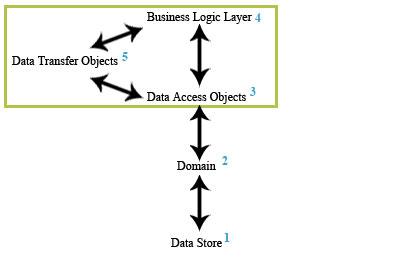
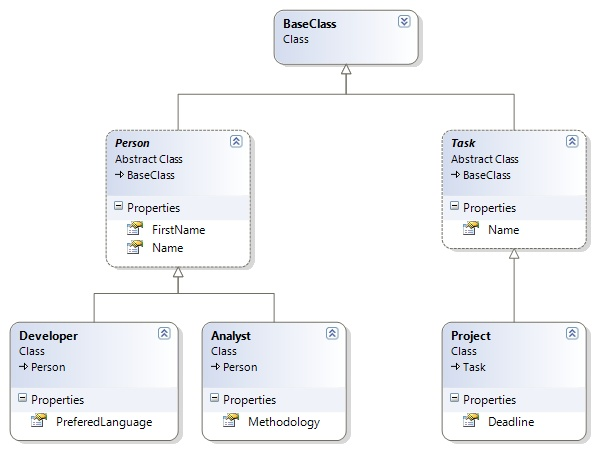
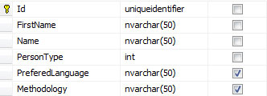
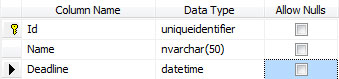
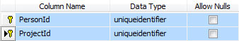
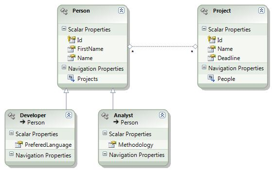
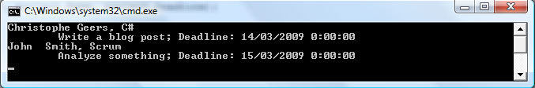

# Data Access Objects with the Entity Framework

## Introduction

For this article / tutorial I will demonstrate a quick and easy way on how to use data access objects (DAO's) with the Entity Framework.

These data access objects form a layer between the business logic and the database access technology. The idea is that the business logic should remain ignorant of the technology used to access the database. Using this "DAO pattern" you can more easily interchange this backing technology.

In the text to come this will be demonstrated by setting up a simple domain model which will be modelled using the Entity Framework. Next a layer of DAO's will be created on top of this domain model.

The business logic will only use these DAO's to request or send back data from or to the underlying data store. How these CRUD operations are handled is entirely up to the implementation of the DAO's and should be of no concert to the business logic.

By decoupling the business objects from the backing data store you can more easily switch to another database access technology such as for say Linq To Sql.

## The Various Parts

Let's quickly iterate the various parts of the architecture we're trying to achieve by illustrating them.

**Figure 1** - The Various Parts



1. **Data Store**: The underlying data store for this article is, as usual, Microsoft SQL Server 2005 Express.
2. **Domain**: The domain will be modelled by the Entity Framework upon the tables found in the database.
3. **Data Access Objects (DAO's)**: The DAO's are responsible for communicating with the domain in order to retrieve and pass data from and back to the underlying data store.
4. **Business Logic**: The domain-specific logic that makes the application actually do stuff will be handled in the business logic or "Manager" layer. This layer consists out of manager class types who's sole responsability is to handle the coordination of work. It uses DAO's to retrieve and manipulate data. The actual CRUD operations are handled by the DAO's. This layer should remain ignorant about how this is actually implemented.

**Remark**: As you may have noticed I skipped the fifth part shown in figure 1. Normally you should create a separate Data Transfer Object (DTO) for each of the objects found in your domain. These DTO's should only carry data and should not contain any logic so that they can be easily serialized and deserialized, they are meant to only transfer data between two points. In this case the DAO's and the business logic layer.

For this article I've choosen to use the domain objects generated by the Entity Framework as DTO's. Although this has the disadvantage of establishing a coupling between the Entity Framework and the business logic layer (a reference to System.Data.Entity is required).

Use them strictly as DTO's and don't call any Entity Framework specific methods on them in the business logic layer or any other layer except in the layer that houses the DAO's. In order words keep the coupling at the absolute minimum. Depending on the scope of the project this is acceptable in my humble opinion.

I hope version 2 of the Entity Framework offers better support for DTO/POCO objects. The IPOCO pattern they have chosen to follow for this first release makes this scenario not impossible but certainly tedious to achieve.

## Domain Model

Let's quickly establish a small and simple domain model. Let's ponder the following class diagram...

**Figure 2** - Simple domain model



The above figure gives you an overview of a simple domain model. As you can see all domain objects are descendant from the BaseClass type.

The left branch of the class diagram displays an abstract class type Person which has two properties called FirstName and Name. Two concrete classes, namely Developer and Analyst in turn derive from this type and add a property specific to themselves.

The Developer class has a property named PreferedLanguage containing the developer's programming language of choice and the Analyst type contains the methodology he likes to use to manage his projects.

On the right branch two types are located. An abstract class type titled Task which has a Name project to identify the task and a concrete implementation of this abstract type called Project which adds a Deadline property to signal when the project should be completed.

This domain model represents a collection of developers and analysts and the projects they are working on. Now we need to map this logical model to external data. In other words these objects need to be mapped to tables in a database.

## The Database

To model the domain I've opted for the bottom-up approach. We start at the bottom by creating our database and then generate a domain/object model using the Entity Framework based on the previously created database. The other way around (Top-down approach) is certainly feasible, but in this case it isn't the fastest approach.

Start by creating a new database named "Projects" by using SQL Server Management Studio Express (or any other tool). Only three tables are required, figures 3, 4 & 5 show you the structure of these tables.

**Figure 3** - Person table



The Developer and Analyst domain objects both map to the Person table. For the left branch depicted in the domain model (figure 2) I've gone for [the table-per-hierarchy storage model](http://msdn.microsoft.com/en-us/library/bb738443.aspx).

A developer and analyst are represented by different types in the domain model but derive from the same base type. However in the data store their data is stored in the same table, all that is required is a descriminator column.

The descriminator column in this case is called PersonType (int) and if it is equal to one the person is a developer or if equal to two an analyst.

**Figure 4** - Project table



For the right branch only one table is needed. As you can see it is quite simple and has all the columns needed to represent the properties of the Project domain object.

If you were to create more descendants of the abstract Task type this table would also need a descriminator column if you were to opt for the table-per-hierarchy approach.

**Figure 5** - ProjectsPerPerson table



The last table ProjectsPerPerson links persons (developers and analysts) to zero or multiple projects. Although this relation is not directly obvious by looking at figure 2 a person can have zero or multiple projects and a project can be worked upon by zero or multiple persons.

**Remark**: The source code accompagnying this article contains an Sql script containing the necessary DDL statements so that you can quickly setup this database.

## Modelling The Domain

Now that the database has been setup let's proceed to model the domain or object model.

Fire up Visual Studio, create a new blank solution called "EntityFrameworkDao" and add a new class library titled "Domain". Delete the automatically generated file Class1.cs and add a new ADO.NET Entity Data Model. Call it "Domain.edmx".

When the Entity Data Model wizard pops up choose to generate the model from the database, but only add the Person table to begin with. You should end up with a model containing only one entity, namely Person.

You now have to manually break up this entity into three separate entities being Person, Developer and Analyst. [Instead of explaining this step-by-step I suggest you take a look the following screencast by Rob Bagby](http://channel9.msdn.com/posts/RobBagby/deCast-Entity-Framework-Modeling-Implementing-Table-Per-Hierarchy/). He does an excellent job at explaining it ([Also take a look at his blog](http://blogs.msdn.com/bags/)).

When that is done update the model from the database and add the Project table. Since this table does not contain a descriminator column there is no need to break it up into other entities.

Last but not least add the ProjectsPerPerson table to the model. This will not result in a new entity being added but will insert a many-to-many relationship between the Person and Project entities.

Be sure to rename the entity sets and navigation properties to something more meaningful. You should end up with an entity data model resembling the following screenshot.

**Figure 6** - The Entity Data Model



You could go as far as to have the Person and Project type share a common base type as shown in figure 2, but I've chosen not to do this as it would disable me from setting a different entity set name on those entities.

## DAO Interfaces

If you recall figure 1 which lists the various parts required to setup our architecture we have now arrived at the third part, namely the nitty-gritty of this article being the Data Access Objects (DAO's). The business logic layer will only obtain DTO's or domain objects in this case through the use of DAO objects, it will not directly query the Entity Data Model.

To further decouple the business logic layer from the Entity Framework we will only program against interfaces which the DAO objects will implement. This way you can provide an implementation of the DAO interfaces that target the Entity Framework, another one that targets Linq To Sql...and so on. Since the business logic layer only programs against the DAO interfaces it does not care about the actual implementation.

**Remark**: Of course this will work optimally if we don't return domain objects to the business logic layer but DTO's as previously mentioned. Since we've choosen to directly return domain objects our implementation still has a coupling to the Entity Framework.

But as said I find it acceptable if you threat these domain objects strictly as DTO's in the business logic layer. This keeps the coupling as minimal as possible so you don't have too much work should you ever need to replace the Entity Framework.

Should you "convert" these domain objects to DTO's the business logic layer and any other layer on top of that (e.g. Presentation Layer) are not affected at all if you change the implementation of the DAO's.

Let's move on to the interfaces. Add a new code library named "Contracts" to the solution.

First we declare an all general purpose interface called IDao from which all the other DAO interfaces will descend. It declares three methods. Save(...) for adding / updating an entity, Delete(...) for deleting an entity and SaveChanges() to persist the changes.

**Listing 1** - IDao Interface

```csharp
public interface IDao<TEntity>
{
    TEntity Save(TEntity entity);
    void Delete(TEntity entity);
    void SaveChanges();
}
```

Listing 2 lists the other Dao interfaces found in the Contracts code library. As you can see the IDeveloperDao, IAnalystDao and IProjectDao interfaces each declare one method that needs to be implemented.

**Listing 2** - Dao Interfaces

```csharp
public interface IPersonDao : IDao<Person>
{ }

public interface IDeveloperDao : IPersonDao
{
    IEnumerable<Developer> GetDevelopers();
}

public interface IAnalystDao : IPersonDao
{
    IEnumerable<Analyst> GetAnalysts();
}

public interface IProjectDao : IDao<Project>
{
    IEnumerable<Project> GetProjectsOfPerson(Person person);
}
```

Finally we also want to relieve the business logic layer from having to instantiate the DAO's directly. To achieve this a factory will be used which needs to implement the following IDaoFactory interface.

**Listing 3** - IDaoFactory interface

```csharp
public interface IDaoFactory
{
    IPersonDao GetPersonDao();
    IDeveloperDao GetDeveloperDao();
    IAnalystDao GetAnalystDao();
    IProjectDao GetProjectDao();
}
```

## DAO Implementation

Before building an Entity Framework implementation of the DAO interfaces we first have to develop a helper class and an extension method for the ObjectContext type.

**Listing 4** - ObjectContextManager class

```csharp
public class ObjectContextManager
{
    private static readonly ProjectsEntities context = new ProjectsEntities();
    private ObjectContextManager() { }
    public static ProjectsEntities Context { get { return context; } }
}
```

Each DAO object will share the same ObjectContext in order to communicate with the Entity Data Model. The ObjectContextManager class provides a static Context property which will always return the same ObjectContext instance. Don't fret too much about the implementation of the ObjectContextManager class, I kept it very short for illustrative purposes. Feel free to improve on this, e.g. by providing a more generic approach so that it can be reused for each ObjectContext type.

**Remark**: Be careful in which type of application you use the ObjectContext as it is not thread safe. For more information on this topic have a look at my previous article [Entity Framework ObjectContext](https://github.com/geersch/EntityFrameworkObjectContext).

**Listing 5** - ObjectContext GetEntitySetName() extension method

```csharp
public static class ObjectContextExtensions
{
    public static string GetEntitySetName(this ObjectContext context, string entityTypeName)
    {
        var container = context.MetadataWorkspace.GetEntityContainer(context.DefaultContainerName, DataSpace.CSpace);
        string entitySetName = (from meta in container.BaseEntitySets
                                where meta.ElementType.Name == entityTypeName
                                select meta.Name).FirstOrDefault();
        return entitySetName;
    }
}
```

The GetEntitySetName(...) extension method of the ObjectContext type returns the entity set name of a given entity. You'll see in a second how this is used. This extension method queries the Entity Framework's metadata in order to retrieve the entity set name. [Have a look at Stefan Cruysberghs article to learn how to do this](http://scip.be/index.php?Page=ArticlesNET26&Lang=NL).

Now that the ground work has been laid, let's finish up. Most of the DAO's will share the same code, so let's encapsulate this in an abstract base class. Take a look at the EntityDao type in Listing 6.

**Listing 6** - EntityDao type

```csharp
public abstract class EntityDao<TEntity> : IDao<TEntity> where TEntity : EntityObject, new()
{
    #region Helper methods

    protected ProjectsEntities Context
    {
        get
        {
            return ObjectContextManager.Context;
        }
    }

    private string entitySetName;
    protected string EntitySetName
    {
        get
        {
            if (String.IsNullOrEmpty(entitySetName))
            {
                entitySetName = Context.GetEntitySetName(typeof(TEntity).Name);
            }
            return entitySetName;
        }
    }

    #endregion

    #region IDao<TEntity> Members

    public TEntity Save(TEntity entity)
    {
        Context.AddObject(EntitySetName, entity);
        SaveChanges();
        return entity;
    }

    public void Delete(TEntity entity)
    {
        Context.DeleteObject(entity);
        SaveChanges();
    }

    public void SaveChanges()
    {
        Context.SaveChanges();
    }

    #endregion
}
```

This makes implementing the DOA interfaces a piece of cake.

**Listing 7** - DAO's

```csharp
public class PersonDao : EntityDao<Person>, IPersonDao
{ }

public class DeveloperDao : PersonDao, IDeveloperDao
{
    #region IDeveloperDao Members

    public IEnumerable<Developer> GetDevelopers()
    {
        return Context.People.OfType<Developer>();
    }

    #endregion
}

public class AnalystDao : PersonDao, IAnalystDao
{
    #region IAnalystDao Members

    public IEnumerable<Analyst> GetAnalysts()
    {
        return Context.People.OfType<Analyst>();
    }

    #endregion
}

public class ProjectDao : EntityDao<Project>, IProjectDao
{
    #region IProjectDao Members

    public IEnumerable<Project> GetProjectsOfPerson(Person person)
    {
        return from project in Context.Projects
               where project.People.Any(p => p.Id == person.Id)
               select project;
    }

    #endregion
}
```

Implementing the IDaoFactory interface is equally simple.

**Listing 8** - DaoFactory class

```csharp
public class DaoFactory : IDaoFactory
{
    #region IDaoFactory Members

    public IPersonDao GetPersonDao()
    {
        return new PersonDao();
    }

    public IDeveloperDao GetDeveloperDao()
    {
        return new DeveloperDao();
    }

    public IAnalystDao GetAnalystDao()
    {
        return new AnalystDao();
    }

    public IProjectDao GetProjectDao()
    {
        return new ProjectDao();
    }

    #endregion
}
```

## Business Logic

For brevity's sake (a bit too late at this point) let's create a simple and light-weight manager class to represent the business logic layer for this article.

**Listing 9** - PersonManager class

```csharp
public class PersonManager
{
    private readonly IDaoFactory daoFactory;

    public PersonManager(IDaoFactory daoFactory)
    {
        this.daoFactory = daoFactory;
    }

    public IEnumerable<Developer> GetDevelopers()
    {
        IDeveloperDao dao = daoFactory.GetDeveloperDao();
        return dao.GetDevelopers();
    }

    public IEnumerable<Analyst> GetAnalysts()
    {
        IAnalystDao dao = daoFactory.GetAnalystDao();
        return dao.GetAnalysts();
    }

    public IEnumerable<Project> GetProjectsOfPerson(Person person)
    {
        IProjectDao dao = daoFactory.GetProjectDao();
        return dao.GetProjectsOfPerson(person);
    }
}
```

Forgive me for not adding too much logic in this class. Using the PersonManager class you can query the developers, analysts and find out on which projects a particular person (developer or analyst) is working.

**Remark**: The constructor of the PersonManager class requires that you pass it an object which implements the IDaoFactory interface. This allows you to use your favorite dependency injection library in order to pass in any IDaoFactory implementation. This is all you need to do in order to interchange which DAO implementation will be used by the business logic.

## A Quick Demo

Let's put all this code to practice in a demo application. To quickly achieve this let's create a new Console application. Add the code shown in Listing 10.

**Listing 10** -Console Application Demo

```csharp
class Program
{
    private static readonly IDaoFactory daoFactory = new DaoFactory();
    private static readonly PersonManager manager = new PersonManager(daoFactory);

    private static void ListProjects(Person person)
    {
        IEnumerable<Project> projects = manager.GetProjectsOfPerson(person);
        foreach (var project in projects)
        {
            Console.WriteLine("\t{0}; Deadline: {1}", project.Name, project.Deadline);
        }
    }

    static void Main()
    {
        IEnumerable<Developer> developers = manager.GetDevelopers();
        foreach(var developer in developers)
        {
            Console.WriteLine(String.Format("{0} {1}, {2}", developer.FirstName, developer.Name, developer.PreferedLanguage));
            ListProjects(developer);
        }

        IEnumerable<Analyst> analysts = manager.GetAnalysts();
        foreach (var analyst in analysts)
        {
            Console.WriteLine(String.Format("{0} {1}, {2}", analyst.FirstName, analyst.Name, analyst.Methodology));
            ListProjects(analyst);
        }

        Console.ReadLine();
    }
}
```

This code displays all the developers and analysts and shows the projects on which each person is working. The output should look something like this.

**Figure 7** - Output



## Summary

This article shows you one possible approach on how to use Data Access Objects (DAO's) together with the entity framework. I encourage the use of Data Transfer Objects (DTO's) together with DAO's if you want to go through the hassle of doing so. If done correctly you should wind up with a business logic layer that's completely discoupled from the domain model.

This article skipped the use of DTO's altogether and uses the domain objects themselves as DTO's. This remains a viable option in my humble opinion as long as you strictly treat them as such.

The only disadvantage is that this requires you to add a reference to the System.Data.Entity assembly to each layer / project that sits on top of the DAO / domain layer thus establishing a coupling, although minimal, to the Entity Framework.

Another disadvantage is that the domain model is too tightly coupled to the Entity Framework technology because each domain object has several attributes and implements at least three interfaces which are all specific to the Entity Framework. Hopefully the EF team will address these Persistence Ignorance issues in the next release.

Dispite some disadvantages I personally feel that the Entity Framework offers too much too ignore and can certainly be a more than useful ORM tool.

For further reading I strongly recommend [Vijay P. Mehta](http://www.linkedin.com/in/vijaypmehta)'s book "[Pro LINQ Object Relational Mapping with C# 2008](http://www.apress.com/book/view/1590599659)".
